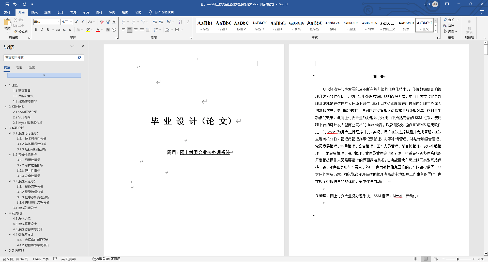
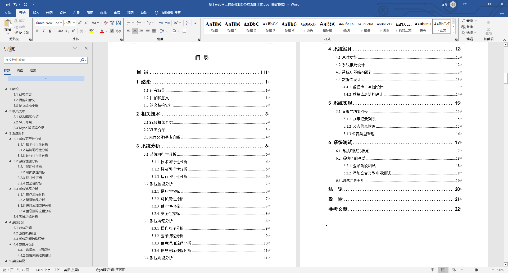
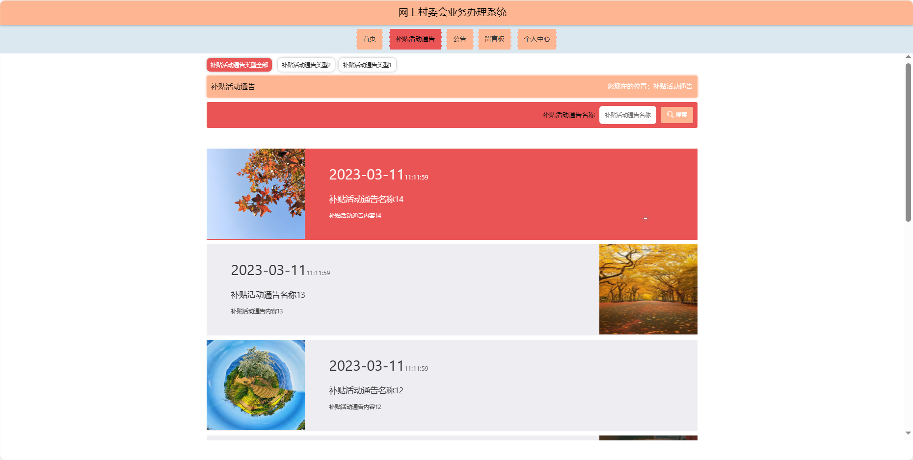
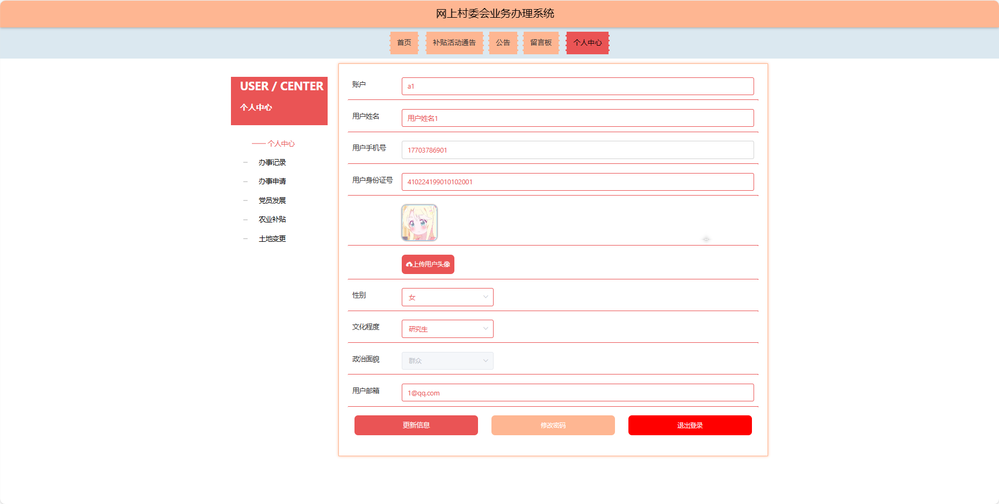

基于Springboot的网上村委会业务办理系统（程序+论文）
=
### 完整代码获取地址：从戎源码网 ([https://armycodes.com/](https://armycodes.com/))
### 作者微信：19941326836  QQ：952045282 
### 承接计算机毕业设计、Java毕业设计、Python毕业设计、深度学习、机器学习
### 选题+开题报告+任务书+程序定制+安装调试+论文+答辩ppt 一条龙服务
### 所有选题地址https://github.com/nature924/allProject

一、项目介绍
---
基于Spring Boot框架实现的网上村委会业务办理系统，系统包含三种角色：管理员、用户,工作人员主要功能如下。
### 【用户功能】

首页：浏览网上村委会业务办理系统的主要信息和最新通知。
补贴活动通告：查看与农村补贴相关的活动通告。
公告：阅读系统发布的相关通知和公告。
留言板：留下对村委会业务的留言和反馈。
个人中心：管理个人信息，查看办事记录和历史留言。

### 【管理员功能】

首页：查看网上村委会业务办理系统整体概况。
个人中心：修改密码、管理个人信息。
管理员管理：审核和管理注册管理员用户的信息。
基础数据管理：管理系统的基础数据，包括办事类型、办事结果、补贴活动通告类型、发展类型、公告类型、农业补贴类型、土地变更类型、文化程度等。
办事记录管理：查看和管理用户的办事记录，包括审批状态和进展。
办事申请管理：处理用户的办事申请请求，包括查看、确认等。
补贴活动通告管理：发布、编辑和删除系统的补贴活动通告。
党员发展管理：监管和管理党员发展的信息，包括申请和审批。
公告管理：发布、编辑和删除系统的通知和公告。
留言板管理：查看和管理用户在留言板上的留言。
农业补贴管理：管理农业补贴的信息，包括类型和审批情况。
土地变更管理：管理土地变更的信息，包括类型和审批情况。
用户管理：审核和管理注册用户的信息。
工作人员管理：审核和管理注册工作人员用户的信息。
轮播图信息：管理系统首页的轮播图。

### 【工作人员功能】

首页：查看网上村委会业务办理系统。
个人中心：修改密码、管理个人信息。
办事记录管理：查看和管理用户的办事记录。
办事申请管理：处理用户的办事申请请求。
补贴活动通告管理：发布、编辑和删除系统的补贴活动通告。
党员发展管理：监管和管理党员发展的信息。
公告管理：发布、编辑和删除系统的通知和公告。
留言板管理：查看和管理用户在留言板上的留言。
农业补贴管理：管理农业补贴的信息。
土地变更管理：管理土地变更的信息。
用户管理：管理用户的信息。

二、项目技术
---
- 编程语言：Java
- 数据库：MySQL
- 项目管理工具：Maven
- 前端技术：VUE、HTML、Jquery、Bootstrap
- 后端技术：Spring、SpringMVC、MyBatis

三、运行环境
---
- 操作系统：Windows、macOS都可以
- JDK版本：JDK1.8以上都可以
- 开发工具：IDEA、Ecplise、Myecplise都可以
- 数据库: MySQL5.7以上都可以
- Tomcat：任意版本都可以
- Maven：任意版本都可以

四、运行截图
---
### 论文截图：

### 程序截图：

